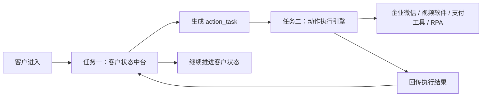
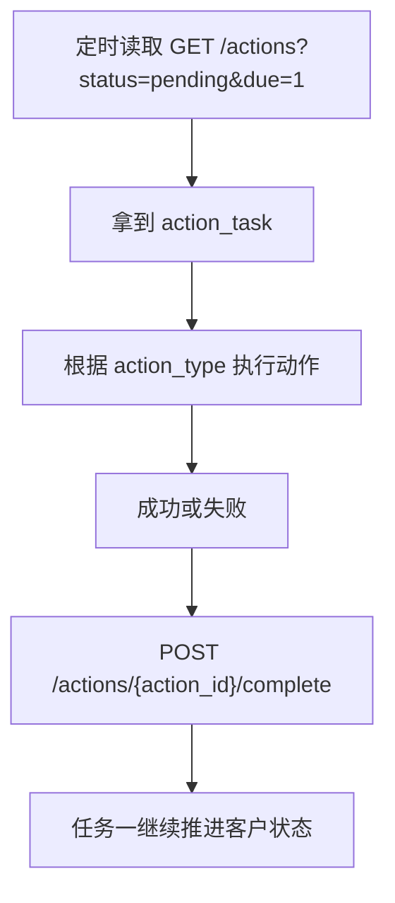

# 自动化业务系统完整任务计划书

更新时间：2026-06-10  
当前项目位置：`D:\Codex\customer-state-center`  
当前已完成模块：任务一，客户状态中台 MVP  
当前未开始模块：任务二，动作执行引擎

## 1. 项目目标

把现有人工客服业务流程拆成可以自动运行的系统。

核心目标：

| 目标 | 说明 |
|---|---|
| 新客户自动进入流程 | 客户一来，系统自动生成发送排队链接任务 |
| 自动判断客户状态 | 判断客户是否点链接、是否发资料、资料是否完整 |
| 自动生成下一步动作 | 根据客户状态生成要发送的话术、登记、视频、付款链接等任务 |
| 支持半自动和全自动 | 前期可以人工或 RPA 执行动作，后期接 API 后全自动 |
| 支持大量客户并发 | 多客户同时来时，系统按任务队列处理，不阻塞 |
| 方便任务二拼接 | 任务一只管判断和派发动作，任务二只管执行动作 |

## 2. 总体架构

推荐采用“一个客户一条主任务，一个动作一条子任务”的结构。



不推荐：

| 方案 | 是否推荐 | 原因 |
|---|---:|---|
| 每个客户开一个真实系统进程 | 不推荐 | 客户多时资源浪费，进程数量难管理，失败恢复困难 |
| 每个步骤开一个真实系统进程 | 不推荐 | 流程容易断裂，状态难追踪 |
| 每个客户一条状态记录，每个步骤一条队列任务 | 推荐 | 稳定、可扩展、容易排查问题 |

## 3. 两个任务模块拆分

### 3.1 任务一：客户状态中台

任务一负责“判断”和“派发动作”，不直接操作企业微信、不直接发视频、不直接发付款链接。

已完成 MVP，位置：

```text
D:\Codex\customer-state-center
```

当前核心文件：

| 文件 | 作用 |
|---|---|
| `state_center.py` | 状态机、数据库、客户判断、动作生成 |
| `app.py` | HTTP 接口服务 |
| `demo_flow.py` | 演示完整业务流程 |
| `test_state_center.py` | 单元测试 |
| `README.md` | 接口说明 |
| `data/demo.sqlite3` | 当前演示数据库 |

### 3.2 任务二：动作执行引擎

任务二负责“真正执行动作”。

它只需要读取任务一生成的 `action_task`，执行完成后把结果回传给任务一。

任务二可以由其他人开发，只要按接口拼接即可。

任务二需要做的事情：

| 步骤 | 说明 |
|---|---|
| 读取待执行动作 | 调用 `GET /actions?status=pending&due=1` |
| 根据动作类型执行 | 比如发企业微信消息、创建视频、发视频、发付款链接 |
| 回传执行结果 | 调用 `POST /actions/{action_id}/complete` |
| 失败时回传原因 | 比如客户删除、无法触达、软件异常 |

## 4. 业务主流程

### 4.1 新客户进入

| 步骤 | 触发条件 | 系统动作 | 执行方 |
|---|---|---|---|
| 1 | 新客户进入 | 创建客户任务 | 任务一 |
| 2 | 客户任务创建成功 | 生成 `SEND_LINK` | 任务一 |
| 3 | 发现 `SEND_LINK` | 给客户发排队链接 | 任务二 |
| 4 | 链接发送成功 | 回传 `LINK_SENT` 或 action success | 任务二 |

### 4.2 客户点击链接

| 步骤 | 触发条件 | 系统动作 | 执行方 |
|---|---|---|---|
| 1 | 客户点击排队链接 | 记录 `LINK_CLICKED` | 任务一 |
| 2 | 客户已点链接但资料不完整 | 等待客户发资料 | 任务一 |
| 3 | 客户已点链接且资料完整 | 进入登记和视频流程 | 任务一 |

### 4.3 客户发截图但没有有效资料

| 步骤 | 触发条件 | 系统动作 | 执行方 |
|---|---|---|---|
| 1 | 客户发截图说“什么都没有” | 判断没有姓名和生日资料 | 任务一 |
| 2 | 资料无效 | 生成 `ASK_FOR_IMAGE_INFO` | 任务一 |
| 3 | 执行话术 | 发送“请把上面图片的信息发我一下” | 任务二 |

### 4.4 客户发部分资料

| 缺失情况 | 系统动作 | 建议话术 |
|---|---|---|
| 有姓名，没有生日 | `ASK_MISSING_BIRTHDAY` | 把出生年月日发我一下 |
| 有生日，没有姓名 | `ASK_MISSING_NAME` | 把姓名发我一下 |
| 姓名和生日都没有 | `ASK_FOR_IMAGE_INFO` 或继续等待 | 请把上面图片的信息发我一下 |

系统需要支持历史资料合并。

例如：

| 第一次消息 | 第二次消息 | 判断结果 |
|---|---|---|
| 张三 | 1998年5月12日 | 自动合并为完整资料 |

### 4.5 客户发完整资料

必要字段：

| 字段 | 是否必需 |
|---|---:|
| 姓名 | 是 |
| 出生年 | 是 |
| 出生月 | 是 |
| 出生日 | 是 |

完整资料后：

| 条件 | 系统动作 |
|---|---|
| 已点链接 | 直接登记 |
| 未点链接 | 先发点链接提醒，再安排 2 分钟检查 |
| 2 分钟内补点链接 | 取消检查，立即登记 |
| 2 分钟后仍未点链接 | 也登记，避免客户流失 |

### 4.6 登记和视频流程

| 步骤 | 系统动作 | 默认时间 |
|---|---|---|
| 1 | `REGISTER_CUSTOMER` | 立即 |
| 2 | `SEND_WAIT_20_MIN_MESSAGE` | 立即 |
| 3 | `CREATE_VIDEO` | 立即或排队 |
| 4 | `SEND_VIDEO` | 默认 20 分钟后 |
| 5 | 视频成功发送后生成 `SEND_PAYMENT_LINK` | 视频后 6 分钟 |

客户收到视频后：

| 情况 | 系统处理 |
|---|---|
| 客户正常可触达 | 6 分钟后发付款链接 |
| 客户删除或无法触达 | 结束任务，取消后续动作 |
| 客户中途发其他消息 | 不影响 6 分钟付款链接 |

### 4.7 异常分支

| 客户行为 | 系统动作 | 说明 |
|---|---|---|
| 付不了款 / 支付失败 | `SEND_PAYMENT_QR` | 直接发付款二维码 |
| 发红包 | `SEND_RED_PACKET_REPLY` | 固定拒收/引导道观话术 |
| 问怎么化解 | `ASK_DONATION_AMOUNT` | 先问“随喜了多少呢？” |
| 删除客户 / 无法触达 | `FINISH_TASK` | 结束任务并取消后续动作 |

## 5. 当前任务一已完成内容

| 功能 | 状态 |
|---|---:|
| 客户主任务 `customer_task` | 已完成 |
| 客户事件 `customer_event` | 已完成 |
| 动作任务 `action_task` | 已完成 |
| 新客户自动生成发链接动作 | 已完成 |
| 链接点击状态记录 | 已完成 |
| 客户资料完整度判断 | 已完成 |
| 部分资料自动合并 | 已完成 |
| 未点链接但发完整资料后的 2 分钟检查 | 已完成 |
| 2 分钟内补点链接后立即登记 | 已完成 |
| 2 分钟后仍未点链接也登记 | 已完成 |
| 登记后生成视频相关动作 | 已完成 |
| 视频成功后 6 分钟发付款链接 | 已完成 |
| 客户删除后取消后续动作 | 已完成 |
| 任务结束后忽略后续客户消息 | 已完成 |
| 红包、付款失败、化解咨询分支 | 已完成基础识别 |
| 单元测试 | 已完成 5 条核心测试 |

## 6. 当前任务一运行方式

进入目录：

```powershell
cd /d D:\Codex\customer-state-center
```

启动服务：

```powershell
python app.py
```

服务地址：

```text
http://127.0.0.1:8787
```

健康检查：

```text
http://127.0.0.1:8787/health
```

运行演示：

```powershell
python demo_flow.py
```

运行测试：

```powershell
python -m unittest -v test_state_center.py
```

## 7. 当前任务一接口

| 接口 | 方法 | 作用 |
|---|---|---|
| `/health` | GET | 健康检查 |
| `/events` | POST | 接收客户事件 |
| `/customers` | GET | 查询客户列表 |
| `/customers/{customer_task_id}` | GET | 查询单个客户任务 |
| `/actions` | GET | 查询动作任务 |
| `/actions?status=pending` | GET | 查询所有待执行动作 |
| `/actions?status=pending&due=1` | GET | 查询已经到时间的待执行动作 |
| `/actions/{action_id}/complete` | POST | 回传动作执行结果 |

## 8. 任务一和任务二拼接协议

任务二只需要按这个流程做：



任务二回传成功示例：

```json
{
  "status": "success",
  "result": {
    "message_id": "MSG_001"
  }
}
```

任务二回传客户删除示例：

```json
{
  "status": "failed",
  "result": {
    "error_code": "CUSTOMER_DELETED",
    "reason": "客户已删除或无法触达"
  }
}
```

## 9. 任务二需要执行的动作清单

| action_type | 执行动作 | 难度 | 是否必须 |
|---|---|---:|---:|
| `SEND_LINK` | 给客户发送排队链接 | 低 | 是 |
| `ASK_FOR_IMAGE_INFO` | 发送补资料话术 | 低 | 是 |
| `ASK_MISSING_BIRTHDAY` | 发送补生日话术 | 低 | 是 |
| `ASK_MISSING_NAME` | 发送补姓名话术 | 低 | 是 |
| `ASK_CLICK_LINK` | 提醒客户点链接 | 低 | 是 |
| `REGISTER_CUSTOMER` | 登记客户资料 | 中 | 是 |
| `SEND_WAIT_20_MIN_MESSAGE` | 发送“稍等20分钟”话术 | 低 | 是 |
| `CREATE_VIDEO` | 创建视频生成任务 | 高 | 是 |
| `SEND_VIDEO` | 给客户发送视频 | 中 | 是 |
| `SEND_PAYMENT_LINK` | 发送付款链接 | 低 | 是 |
| `SEND_PAYMENT_QR` | 发送付款二维码 | 低 | 是 |
| `SEND_RED_PACKET_REPLY` | 发送红包拒收/引导话术 | 低 | 是 |
| `ASK_DONATION_AMOUNT` | 询问随喜金额 | 低 | 是 |
| `FINISH_TASK` | 结束客户任务 | 低 | 是 |

## 10. 后续开发阶段计划

### 阶段一：任务一完善

| 序号 | 任务 | 难度 | 状态 |
|---:|---|---:|---:|
| 1 | 修正文档编码，保证中文正常显示 | 低 | 待做 |
| 2 | 增加后台查看页面 | 中 | 待做 |
| 3 | 话术配置化，不写死在代码里 | 中 | 待做 |
| 4 | 增加客户状态筛选和搜索 | 中 | 待做 |
| 5 | 增加动作重试、失败原因展示 | 中 | 待做 |
| 6 | 增加更多单元测试 | 中 | 待做 |
| 7 | 数据库从 SQLite 升级到 PostgreSQL | 中 | 后期做 |
| 8 | 增加 Redis 或专业队列 | 中 | 后期做 |

### 阶段二：任务二开发

| 序号 | 任务 | 难度 | 说明 |
|---:|---|---:|---|
| 1 | 轮询任务一动作接口 | 低 | 每 1 到 3 秒读取一次 due action |
| 2 | 实现企业微信消息发送 | 高 | 取决于企业微信 API 权限或 RPA 稳定性 |
| 3 | 实现短链接生成和点击回调 | 中 | 需要链接服务和回调接口 |
| 4 | 实现视频创建动作 | 高 | 取决于视频软件是否有 API |
| 5 | 实现视频发送动作 | 中 | 可能用 API、企微上传或 RPA |
| 6 | 实现付款链接和二维码发送 | 中 | 取决于支付工具 |
| 7 | 实现执行失败回传 | 中 | 必须回传客户删除、软件异常等状态 |
| 8 | 增加任务二日志页面 | 中 | 方便排查执行失败 |

### 阶段三：真实业务接入

| 序号 | 任务 | 难度 | 说明 |
|---:|---|---:|---|
| 1 | 接真实企业微信客户 ID | 中 | 每个客户必须有稳定唯一 ID |
| 2 | 接真实客户消息来源 | 高 | 官方 API、企微侧边栏、客服系统或 RPA |
| 3 | 接真实短链点击数据 | 中 | 客户点击后回传给任务一 |
| 4 | 接 OCR/AI 资料识别 | 中 | 自动从截图或文字里提取姓名生日 |
| 5 | 接视频生成软件 | 高 | 取决于视频软件能力 |
| 6 | 接支付系统 | 中 | 付款链接、二维码、支付状态 |
| 7 | 灰度测试 | 中 | 先小流量跑，不直接全量 |
| 8 | 全量上线 | 高 | 需要监控、告警、人工兜底 |

## 11. 全自动化可行性评估

| 模块 | 全自动可行性 | 风险 |
|---|---:|---|
| 客户状态判断 | 高 | 需要继续完善特殊话术和异常分支 |
| 客户资料识别 | 中高 | 文本容易，截图需要 OCR/AI |
| 自动发送消息 | 中 | 取决于企业微信 API 权限 |
| 自动发送链接 | 中高 | 有 API 最好，没有 API 需要 RPA |
| 链接点击回调 | 高 | 可通过自建短链服务实现 |
| 自动生成视频 | 中 | 取决于视频软件是否支持 API 或稳定 RPA |
| 自动发送视频 | 中 | 大文件上传和企微限制需要测试 |
| 自动发送付款链接 | 中高 | 取决于支付工具和企业微信发送能力 |
| 客户删除识别 | 中 | 需要任务二执行时判断失败原因 |

结论：

| 方案 | 可行性 | 建议 |
|---|---:|---|
| 全自动化 | 中等可行 | 需要 API 权限、视频软件接口、稳定执行环境 |
| 半自动化 | 高可行 | 任务一自动判断，任务二先由人工/RPA执行，逐步替换成 API |

建议先做半自动，再逐步升级全自动。

## 12. 可执行点和不可执行点

### 12.1 低难度可执行点

| 点位 | 说明 |
|---|---|
| 自动创建客户任务 | 当前已完成 |
| 自动生成发送链接任务 | 当前已完成 |
| 自动判断资料是否完整 | 当前已完成基础版 |
| 自动生成补资料话术 | 当前已完成 |
| 自动生成付款链接动作 | 当前已完成 |
| 自动记录客户删除后结束任务 | 当前已完成 |

### 12.2 中难度可执行点

| 点位 | 说明 |
|---|---|
| 后台页面 | 需要做网页界面 |
| 话术配置化 | 需要配置文件或数据库表 |
| OCR/AI 识别资料 | 需要接 OCR 或模型 |
| 短链接点击回调 | 需要一个链接服务 |
| 任务二动作执行器 | 需要开发 Worker |

### 12.3 高难度可执行点

| 点位 | 说明 |
|---|---|
| 企业微信自动收发 | 取决于 API 权限，没权限就要 RPA |
| 视频自动生成 | 取决于视频软件接口能力 |
| 高并发稳定运行 | 需要 PostgreSQL、Redis、队列、监控 |
| 完整全自动上线 | 需要大量真实场景测试 |

### 12.4 暂时不可执行但可解决

| 点位 | 原因 | 解决方式 |
|---|---|---|
| 真实企微消息自动收发 | 需要 API 权限或登录环境 | 申请官方接口，或使用 RPA |
| 视频软件自动化 | 不确定是否有 API | 优先查官方接口，没有再用 RPA |
| 支付状态自动确认 | 需要支付平台接口 | 接支付平台 API |
| 客户截图精准识别 | 截图质量不可控 | OCR + AI + 人工兜底 |

### 12.5 原则上不可执行或不建议执行

| 点位 | 原因 |
|---|---|
| 通过链接直接获取客户手机信号 | 普通网页链接无法合法直接获取手机信号 |
| 绕过平台风控检测违规内容 | 不建议做规避平台审核的技术 |
| 未经授权采集客户敏感信息 | 有合规风险 |
| 伪装文字让系统检测不到 | 有平台风控和合规风险，不建议作为系统目标 |

## 13. 需要安装或准备的软件

当前任务一 MVP 只需要：

| 软件 | 是否已满足 |
|---|---:|
| Python 3.11 | 已满足 |

后续如果继续开发生产版，建议准备：

| 软件/服务 | 用途 |
|---|---|
| PostgreSQL | 生产数据库 |
| Redis | 队列、延迟任务、缓存 |
| Node.js 或 Python FastAPI | 正式后端服务 |
| 企业微信开放平台权限 | 官方消息收发 |
| OCR 服务 | 图片资料识别 |
| 视频生成软件/API | 自动生成视频 |
| 支付平台接口 | 自动发送付款链接或二维码 |
| 服务器 | 7x24 小时运行 |

## 14. 下一步推荐执行顺序

| 顺序 | 任务 | 负责人 |
|---:|---|---|
| 1 | 确认任务一当前 MVP 能正常运行 | 当前项目负责人 |
| 2 | 修正文档中文编码问题 | 任务一负责人 |
| 3 | 增加客户后台页面 | 任务一负责人 |
| 4 | 把话术配置化 | 任务一负责人 |
| 5 | 任务二开发读取动作接口 | 任务二负责人 |
| 6 | 任务二先实现低难度动作发送 | 任务二负责人 |
| 7 | 拼接任务一和任务二跑完整模拟流程 | 双方 |
| 8 | 接真实企业微信/短链/视频/支付 | 双方 |
| 9 | 小流量灰度测试 | 双方 |
| 10 | 全量上线 | 双方 |

## 15. 当前交接说明

如果新窗口或其他开发者继续任务一，直接给他这个路径：

```text
D:\Codex\customer-state-center
```

让他先运行：

```powershell
cd /d D:\Codex\customer-state-center
python -m unittest -v test_state_center.py
```

如果测试通过，再启动：

```powershell
python app.py
```

任务二开发者只需要看这三个接口：

```text
GET  /actions?status=pending&due=1
POST /actions/{action_id}/complete
POST /events
```

这样两个模块就能像积木一样拼起来。
